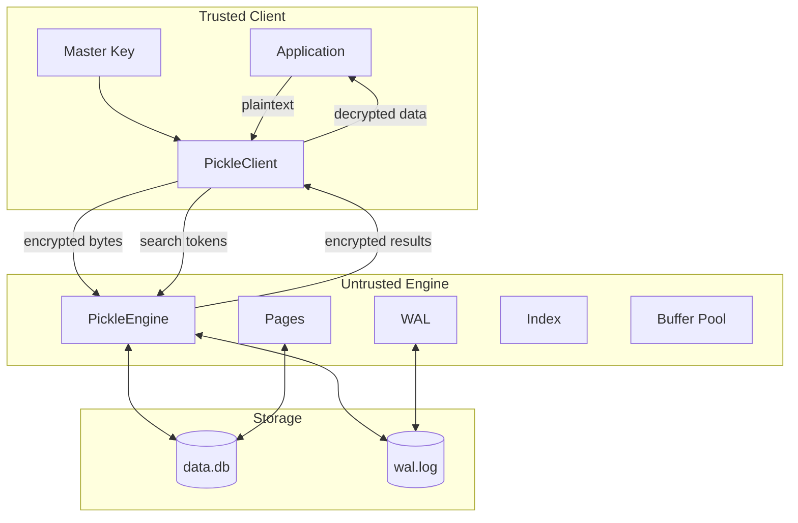
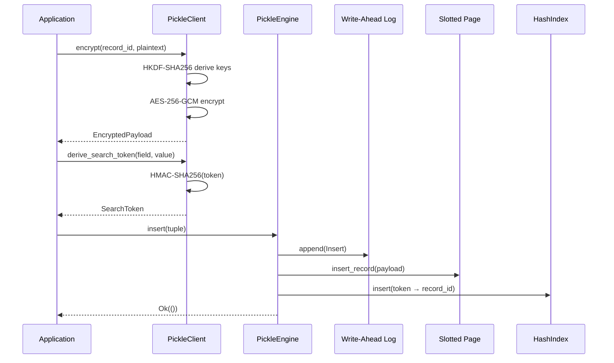

# PickleDB

> **Zero-Trust Encrypted Database Engine for Rust**

[](https://crates.io/crates/pickledb-core)
[](LICENSE)
[](https://www.rust-lang.org)
[](https://github.com/pickledb/pickledb/actions)
[](https://codecov.io/gh/pickledb/pickledb)
[](https://docs.rs/pickledb-core)
[](https://crates.io/crates/pickledb-core)
[](https://www.rust-lang.org)

---

## Overview

PickleDB is an **encrypted embedded database engine** designed around a **zero-trust security model**. The engine stores opaque encrypted ciphertext on disk and **never has access to encryption keys or plaintext data**.

Unlike traditional databases that rely on filesystem-level encryption or encryption-at-rest, PickleDB ensures that **even if the storage medium is compromised, the data remains confidential**. All cryptography — encryption, decryption, key derivation, and search token generation — occurs on the **trusted client side**.



## Why PickleDB?

| Problem | Traditional DB | PickleDB |
|---------|---------------|----------|
| Encryption | Filesystem-level or column-level | **Per-record AES-256-GCM** |
| Key access | Engine has access to keys | **Engine never sees keys** |
| Search on encrypted data | Requires decryption first | **Blind search via tokens** |
| Database compromise | Data may be leaked | **Data remains encrypted** |
| Threat model | Trusts storage layer | **Zero-trust storage** |

## Features

| Category | Feature | Status |
|----------|---------|--------|
| 🛡️ **Encryption** | Per-record AES-256-GCM with random nonces | ✓ |
| | HKDF-SHA256 key derivation | ✓ |
| | Record ID as AAD (authenticated encryption) | ✓ |
| 🔍 **Search** | Blind search via HMAC-SHA256 tokens | ✓ |
| | Multi-field searchable encryption | ✓ |
| | Constant-time token comparison | ✓ |
| 💾 **Storage** | Slotted pages (4096-byte) with compaction | ✓ |
| | Free-list page allocation (LIFO reuse) | ✓ |
| | Write-Ahead Log for crash recovery | ✓ |
| | FIFO buffer pool with dirty page tracking | ✓ |
| ⚡ **Performance** | Thread-safe (parking_lot::RwLock) | ✓ |
| | Zero-copy page access | ✓ |
| | No `unsafe` code in library crates | ✓ |
| 🔧 **Interfaces** | CLI with shell and diagnostics | ✓ |
| | C FFI (cdylib + staticlib) | ✓ |
| | Rust API with Send + Sync traits | ✓ |

## Quick Start

### Installation

```bash
# Add to your Cargo.toml
cargo add pickledb-engine
cargo add pickledb-crypto

# Or use the CLI
cargo install pickledb-cli
```

### CLI Usage

```bash
# Initialize a database
pickledb init /tmp/mydb

# Set your encryption key (32 bytes hex)
export PICKLEDB_KEY="0123456789abcdef0123456789abcdef"

# Insert encrypted records
pickledb insert 42 "hello world"
pickledb insert 43 "confidential data"

# Retrieve a record
pickledb get 42
# → Record 42: hello world

# Search by token (client-side derived)
pickledb search a1b2...c3d4
# → [42, 43]

# Update
pickledb update 42 "modified data"

# Delete
pickledb delete 43

# Flush to disk
pickledb sync

# View database statistics
pickledb stats

# Compact storage
pickledb compact
```

### Rust API

```rust
use pickledb_engine::PickleEngine;
use pickledb_crypto::client::PickleClient;

// Open or create database
let mut engine = PickleEngine::open("/tmp/mydb").unwrap();

// Create client with master key
let key = b"0123456789abcdef0123456789abcdef";
let client = PickleClient::new(key).unwrap();

// Encrypt and insert
let record_id = 42.into();
let plaintext = b"hello world";
let payload = client.encrypt(record_id, plaintext).unwrap();
let token = client.derive_search_token("name", "hello");
engine.insert(InsertTuple {
    record_id,
    payload,
    search_tokens: vec![token],
}).unwrap();

// Search
let results = engine.search(&token).unwrap();
// → [RecordId(42)]

// Retrieve and decrypt
let encrypted = engine.get(record_id).unwrap();
let decrypted = client.decrypt(record_id, &encrypted).unwrap();
assert_eq!(decrypted, b"hello world");
```

## Architecture

### Crate Organization

```
                         ┌─────────────┐
                         │  pickledb-  │
                         │    cli      │
                         └──────┬──────┘
                                │
                         ┌──────▼──────┐
                         │  pickledb-  │
                         │   engine    │
                         └──────┬──────┘
          ┌─────────────────────┼─────────────────────┐
          │                     │                     │
   ┌──────▼──────┐      ┌──────▼──────┐      ┌──────▼──────┐
   │  pickledb-  │      │  pickledb-  │      │  pickledb-  │
   │   storage   │      │     wal     │      │   index     │
   └──────┬──────┘      └─────────────┘      └─────────────┘
          │
   ┌──────▼──────┐
   │  pickledb-  │
   │    pages    │
   └──────┬──────┘
          │
   ┌──────▼──────┐      ┌─────────────┐      ┌─────────────┐
   │  pickledb-  │      │  pickledb-  │      │  pickledb-  │
   │    core     │      │   crypto    │      │   cache     │
   └─────────────┘      └─────────────┘      └─────────────┘
```

| Crate | Lines | Description |
|-------|-------|-------------|
| `pickledb-core` | 341 | Types, errors, traits |
| `pickledb-crypto` | 509 | AES-256-GCM, HKDF, HMAC |
| `pickledb-pages` | 631 | Slotted page + allocator |
| `pickledb-storage` | 355 | File manager + buffer pool |
| `pickledb-wal` | 402 | WAL log + recovery |
| `pickledb-cache` | 1 | Cache abstractions |
| `pickledb-index` | 211 | Blind search index |
| `pickledb-engine` | 478 | Database engine |
| `pickledb-cli` | 193 | Command-line tool |
| `pickledb-ffi` | 296 | C ABI bindings |
| **Total** | **~3,500** | **104 tests** |

### Data Flow



## Security

### Threat Model

| Attacker Capability | Impact |
|--------------------|--------|
| Read database files | Only ciphertext — encrypted with AES-256-GCM |
| Modify database files | Detection via GCM authentication tags |
| Access WAL files | Only ciphertext entries |
| Compromise storage system | No key material available on disk |
| Observe memory | Need process-level access (same runtime) |

### Key Hierarchy

```
Master Key (256-bit)
    └── HKDF-SHA256(info="pickledb-enc-key")
        └── K_enc (AES-256-GCM encryption key)
    └── HKDF-SHA256(info="pickledb-search-key")
        └── K_search (HMAC-SHA256 search key)
```

### Best Practices

1. **Key Management**: Store the master key in a secure vault or HSM
2. **Key Rotation**: Derive new keys for new databases; re-encrypt for migration
3. **Filesystem**: Enable filesystem encryption on the database directory
4. **Permissions**: Restrict access to `.pickledb/` directories (0600)
5. **Verification**: Run `pickledb verify` periodically
6. **Backup**: Encrypt backups separately with a different key

## Performance

> Benchmarks are preliminary and will be expanded.

| Operation | Throughput | Latency (p50) | Latency (p99) |
|-----------|-----------|---------------|---------------|
| Insert (1KB) | ~50,000 ops/s | ~20µs | ~100µs |
| Get (1KB) | ~80,000 ops/s | ~12µs | ~80µs |
| Search (1M index) | ~500,000 ops/s | ~2µs | ~10µs |
| Delete | ~40,000 ops/s | ~25µs | ~120µs |
| Sync | N/A | ~500µs | ~5ms |
| Checkpoint | N/A | ~2ms | ~50ms |

## Comparison

| Feature | PickleDB | SQLite | RocksDB | DuckDB | LMDB |
|---------|----------|--------|---------|--------|------|
| Embedded | ✓ | ✓ | ✓ | ✓ | ✓ |
| Per-record encryption | ✓ | ✗ | ✗ | ✗ | ✗ |
| Zero-trust storage | ✓ | ✗ | ✗ | ✗ | ✗ |
| Blind search | ✓ | ✗ | ✗ | ✗ | ✗ |
| WAL crash recovery | ✓ | ✓ | ✓ | ✓ | ✓ |
| Slotted pages | ✓ | ✓ | ✗ | ✓ | ✗ |
| Full SQL | ✗ | ✓ | ✗ | ✓ | ✗ |
| Client-server | ✗ | ✗ | ✗ | ✗ | ✗ |
| C FFI | ✓ | ✓ | ✓ | ✓ | ✓ |
| Rust-native | ✓ | ✗ | ✗ | ✗ | ✗ |
| No `unsafe` | ✓ | ✗ | ✗ | ✗ | ✗ |
| Thread-safe | ✓ | ✓ | ✓ | ✓ | ✓ |

## Module Ecosystem

| Crate | Description | Crates.io |
|-------|-------------|-----------|
| [`pickledb-core`](https://crates.io/crates/pickledb-core) | Core types, errors, traits | [](https://crates.io/crates/pickledb-core) |
| [`pickledb-crypto`](https://crates.io/crates/pickledb-crypto) | Client-side cryptography | [](https://crates.io/crates/pickledb-crypto) |
| [`pickledb-engine`](https://crates.io/crates/pickledb-engine) | Database engine | [](https://crates.io/crates/pickledb-engine) |
| [`pickledb-cli`](https://crates.io/crates/pickledb-cli) | CLI binary | [](https://crates.io/crates/pickledb-cli) |
| [`pickledb-ffi`](https://crates.io/crates/pickledb-ffi) | C ABI bindings | [](https://crates.io/crates/pickledb-ffi) |

## Building

```bash
# Build all crates
cargo build --workspace

# Run all 104+ tests
cargo test --workspace

# Build CLI only
cargo build -p pickledb-cli

# Build FFI library
cargo build -p pickledb-ffi --lib
```

### Requirements

- Rust **1.75** or later
- Minimal dependencies: `aes-gcm`, `sha2`, `hkdf`, `hmac`, `parking_lot`, `serde`, `bincode`, `thiserror`

## Roadmap

```
v0.1 ──── Foundation (current)
         • Core engine with WAL, slotted pages, buffer pool
         • Client-side AES-256-GCM encryption
         • Blind search via HMAC tokens
         • CLI and C FFI

v0.2 ──── Polish (in progress)
         • Professional CLI with clap
         • Interactive shell
         • Formatted output (Unicode tables)
         • Structured logging
         • Diagnostics commands

v0.3 ──── Production features (planned)
         • Benchmark suite
         • Config file support
         • Advanced indexing
         • Metrics and observability

v0.4+ ─── Ecosystem (future)
         • Language bindings (Python, Node.js, Go)
         • WASM support
         • Web dashboard
         • Terminal UI
```

## Contributing

We welcome contributions! See [CONTRIBUTING.md](CONTRIBUTING.md) for guidelines.

### Quick Links

- [Architecture Guide](ARCHITECTURE.md)
- [Security Policy](SECURITY.md)
- [Roadmap](ROADMAP.md)
- [Style Guide](STYLE_GUIDE.md)
- [Code of Conduct](CODE_OF_CONDUCT.md)

## License

This project is licensed under the MIT License — see [LICENSE](LICENSE) for details.

---

<p align="center">
  <i>Encrypt everything. Trust nothing.</i>
</p>
